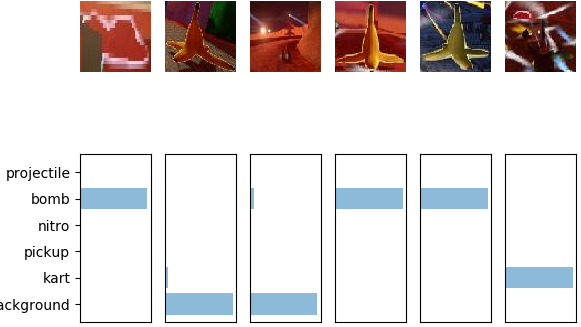
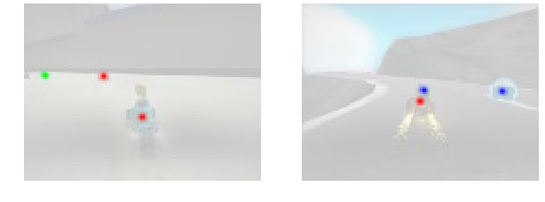
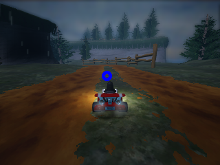

# Deep Learning Models (PyTorch)

## Image Classification & Segmentation

**Folder:** Semantic Segmentation

* *Image classification* was performed using a CNN architecture. The model created to predict the following 6 categories with high accuracy:
  * Projectile
  * Bomb
  * Nitro
  * Pickup
  * Kart
  * Background

* *Image segmentation* was performed using a FCN architecture. The model performs pixel-wise classification to identify where the entities specified above appear in a single image. Convolutions were used to encode the image, then transpose convolutions were used to decode the image and maintain original image dimensions. The last layer consists of 6 channels, each channel representing one of the above categories.

## Object Detection

**Folder:** Object Point Detection

Point detection was used to determine the central location of an object. This also required the use of FCN architecture, with the last layer consisting of 16 channels. Each individual channel simply consisted of a single prediction for an object location. A peak extractor function was also implemented to determine the point location out of the model's rather chaotic output.

## Racer

**Folder:** Racer AI

The AI racer uses the exact same architecture used for *Object Detection*, except that it has only a single output channel. The channel output, along with the peak extractor function, would be used to determine where the racer would move next, from the racer's point of view. A controller was then manually implemented to make the racer move accordingly.

## Hockey Player

**Folder:** Hocker Player AI

The AI hockey player, more so than knowing exactly where to move, needs to know where the puck is at all times. *Image Segmentation* was used for this task, with a single output channel to detect pixels that showed the puck. The global positions of the goal post and cars were always provided; a controller was then created to make the AI use these global positions and predicted puck locations to hit the puck at an angle towards the goal location. The AI also follows the puck towards the goal. When the AI isn't able to see the puck, it moves back to a location near it's own goal and waits for the puck to come near it. 